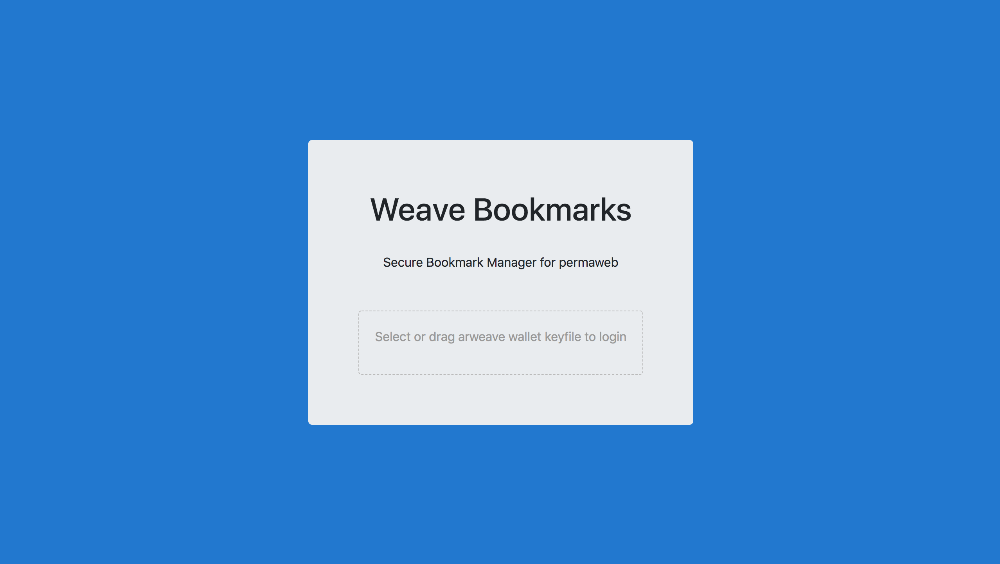
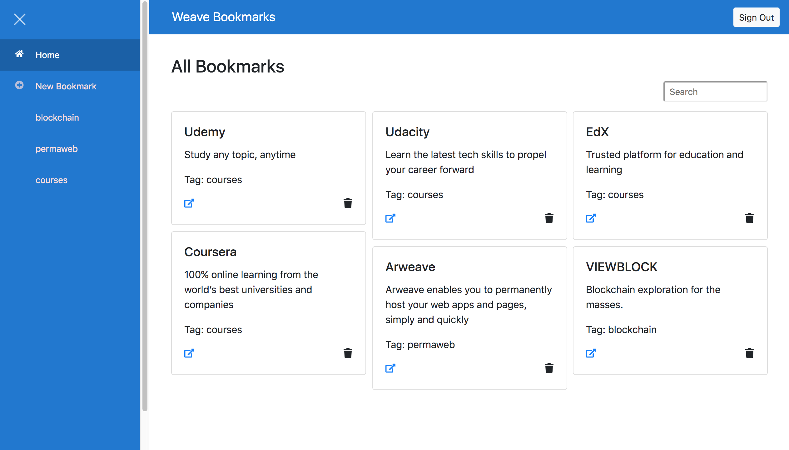
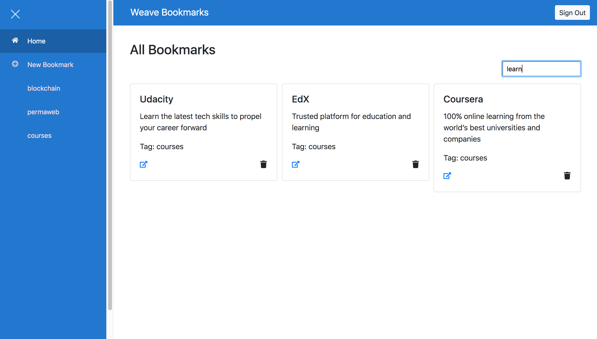
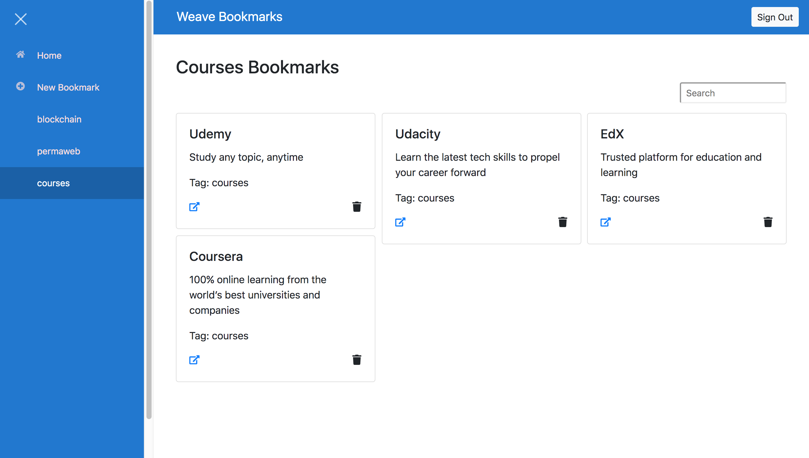
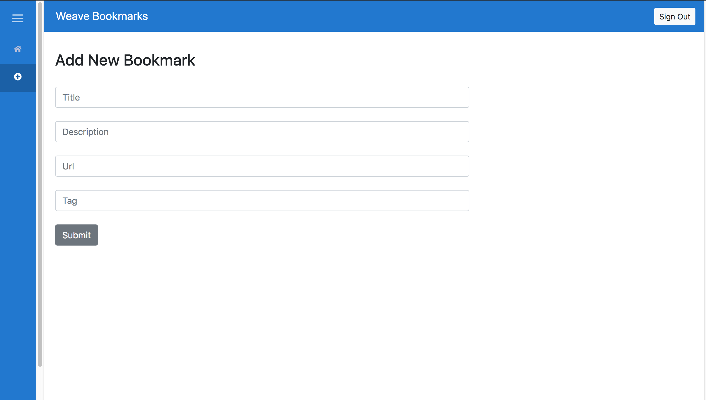

## Weave Bookmarks
Secure Bookmark Manager for permaweb

## App URL
https://arweave.net/5GheiqREIB1iRLa1QXSH3E_hPoRs9HNX2koXaO8gVGk 
(Login to the app using your Arweave wallet keyfile)

## Screenshots

### Login


### All Bookmarks


### Search Bookmarks


### View Bookmarks (Tags)


### Add Bookmarks


## Features
* Add Bookmarks
* Specify tag for Bookmarks
* View All Bookmarks
* View Bookmarks based on tags
* Search Bookmarks
* Delete Bookmarks
* Sync bookmarks securely across devices
* Bookmarks are encrypted using user's public key using RSA-OAEP and crypto.js
* Decentralized login

## Arweave Features used
* App is published on the permaweb using Arweave Deploy
* Permaweb app interacts with Arweave using ArweaveJS
* Decentralized login using Arweave
* ArQL is used to get your encrypted bookmarks from the network

## Getting Started

1) Clone Repo

    ```
    git clone https://github.com/viraja1/weave_bookmarks.git
    ```

2) Change directory
    
   ```
   cd weave_bookmarks
   ```

3) Install Dependencies
   
   ```
   npm install
   ```

4) Start Client App (For developing & debugging)

   ```
   npm start 
   ```
   
5) Open client app url in chrome

   ```
   http://localhost:8080
   ```
   
6) Build app    

   ```
   npm run build 
   ```
   
7) Deploy app to arweave 

   ```
   npm install -g arweave-deploy
   cd public/build
   arweave deploy index.html --package --key-file path/to/arweave-key.json
   ```
   
   Steps to generate keyfile - https://docs.arweave.org/developers/tools/arweave-deploy#generate-a-keyfile
   
   Arweave deploy command prints the deployed url in console. Wait for transaction to be confirmed.

8) Test deployed app
   ```
   https://arweave.net/5GheiqREIB1iRLa1QXSH3E_hPoRs9HNX2koXaO8gVGk
   ```
